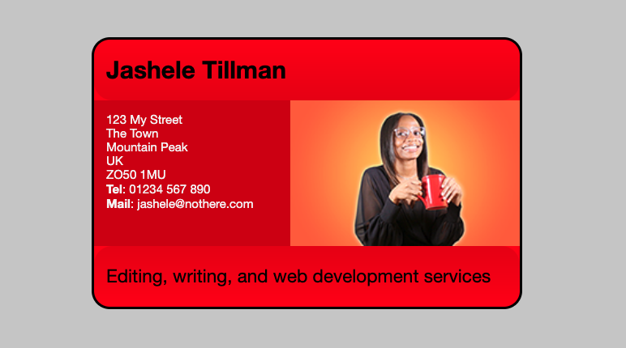

# Final Project (preview)

Link: https://jasheloper.github.io/fundamental-css-comprehension/

 

## Objective

To test comprehension of fundamental CSS theory, syntax and mechanics.

 

## Project Guidelines

https://developer.mozilla.org/en-US/docs/Learn/CSS/Building_blocks/Fundamental_CSS_comprehension
